# Utiliser Chataigne rapidement

Le but est de 

## L'interface

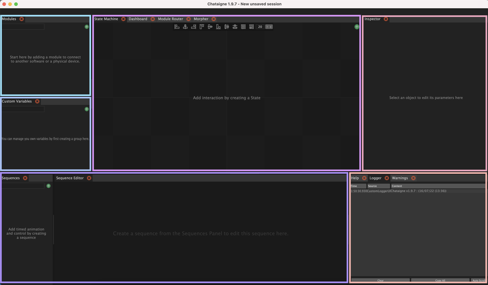

L'interface de Chataigne est divisée en 6 parties.
 - Modules, où on ajoute chacun des modules de connexion utilisés dans le projet.
 - Custom Variables
 - Sequences + Sequence Editor, la timeline
 - State Machine, pour créer des conditions et des conséquences ////
 - Inspector, où on peux modifier les paramètres de l'élement selectionné
 - Help + Logger + Warnings

## Modules

La partie module permet d'ajouter des modules de communication, soit avec des protocoles d'échanges de données, des controleurs physiques ou des logiciels.

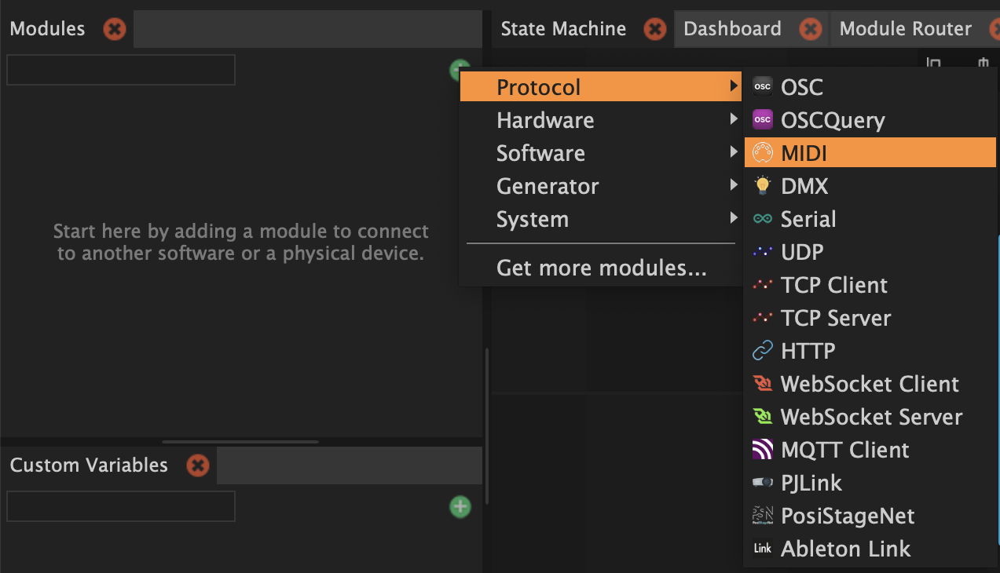

En créant un module, on a accès à ses paramètres dans l'Inspector.

### Controleur Midi

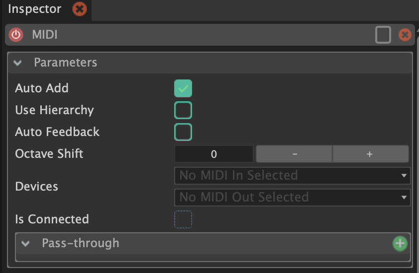

Pour un module de communication MIDI par exemple, on peux choisir notamment le controleur MIDI dont l'on souhaite récuperer les données.

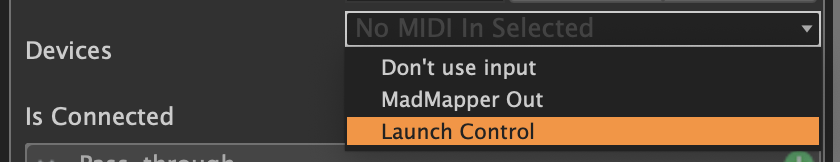

J'utilise ici le controleur Launch Control.

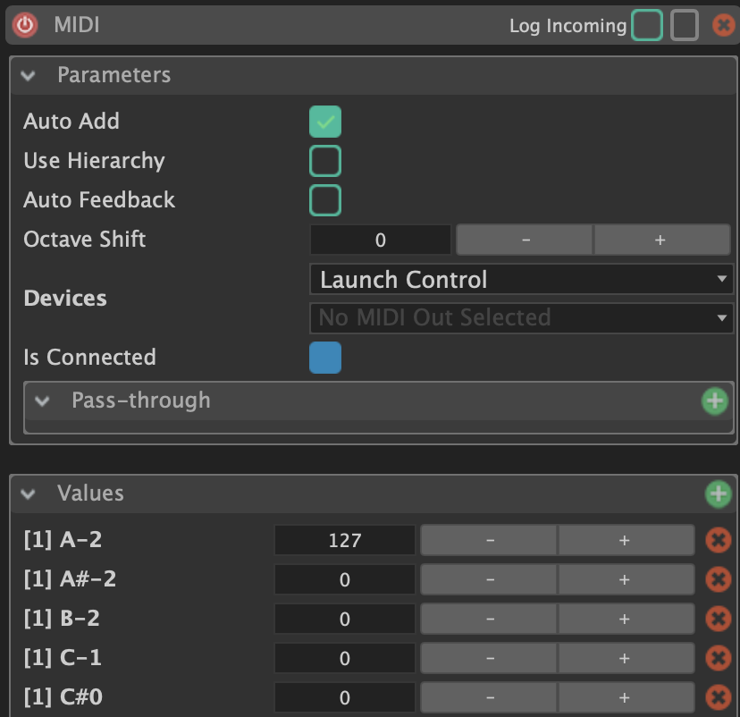

Lorsque la case `Auto Add` est cochée, les valeurs des touches de mon controleur apparaissent automatiquement dans la partie Values lorsque j'appuie dessus, 0 étant non pressée et 127 la valeur pressée.

## State Machine

On peux exploiter ce genre de données dans la State Machine, en créant des conditions : on crée un nouveau State en double-cliquant sur la partie State Machine.

### Actions

En cliquant sur le + en haut à droite, on peux créer une Action et  choisir ses conditions dans ses paramètres dans l'Inspector.

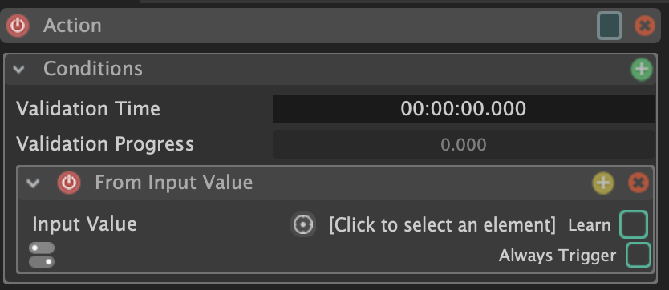

On sélectionne la valeur sur laquelle on teste la condition, ici la première touche `A-2` de mon controleur, dans le module MIDI, dans la partie `From Input Value`.

On choisit ensuite la condition qu'on teste, à quoi est-ce qu'on compare notre valeur, ici quand la valeur de la touche est égale à 127 (donc qu'elle est appuyée).

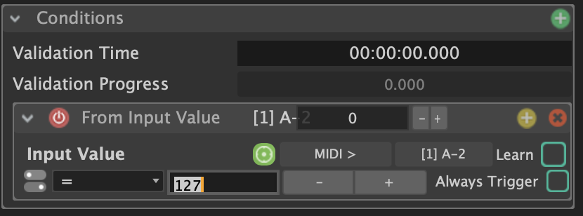

Dans les parties `Consequences : TRUE` et `Consequences : FALSE`, on peux ainsi lancer des actions qui se déclenchent en fonction de si la condition est remplie ou non.

### Connecter Madmapper et Chataigne

On peux par exemple contrôler des visuels sur Madmapper avec les actions de Chataigne.

Pour cela, il faut ajouter le module OSCQuery, qui permet de récuperer les données de MadMapper en OSC.

Il faut que le port `Remote port` dans les paramètres OSCQuery soit le même que l'`OSC Input Port` dans les Préférences de Madmapper pour qu'ils puissent communiquer : ici 8010.
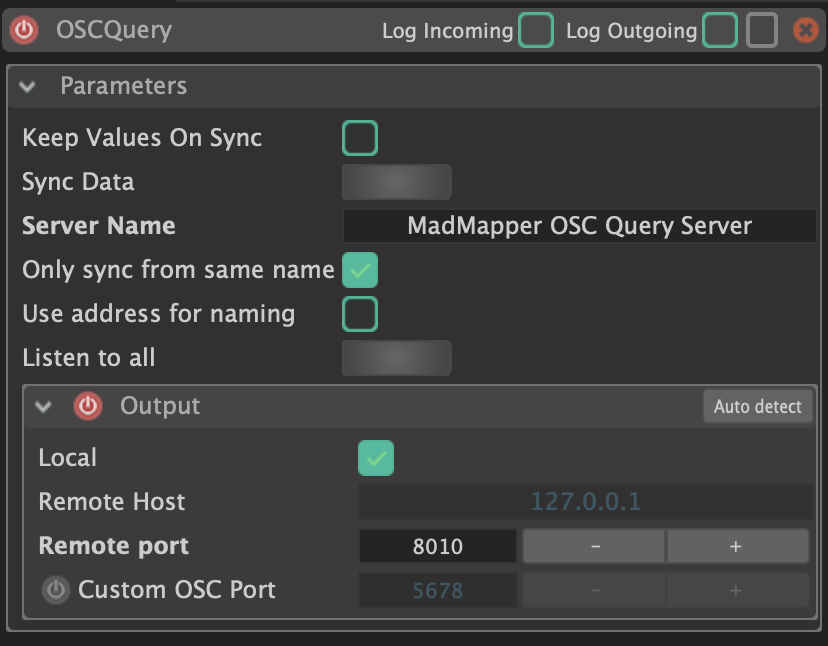

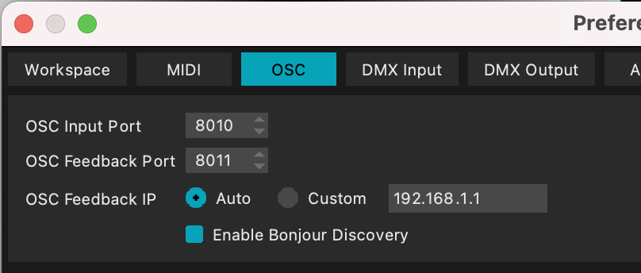

Une fois que c'est le cas, les élements de Madmapper apparaissent dans la partie `Values` des paramètres d'OSCQuery :

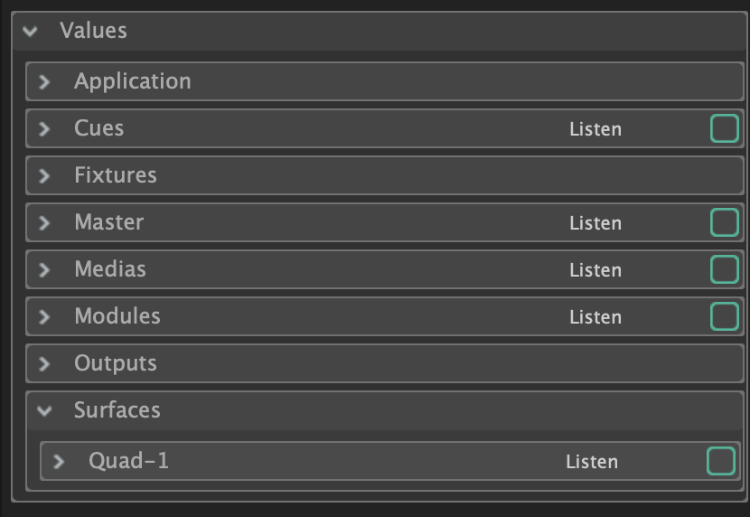

On peux retourner dans l'action crée précedemment dans la State Machine, cliquer sur le + dans les conséquences vraies et choisir `Set Value` dans `OSCQuery`. 

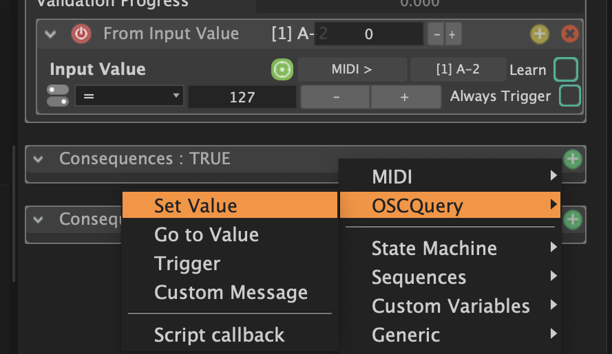

On choisit ensuite quelle valeur on veux modifier, la `Target`: ici la visibilité de la surface Quad-1.

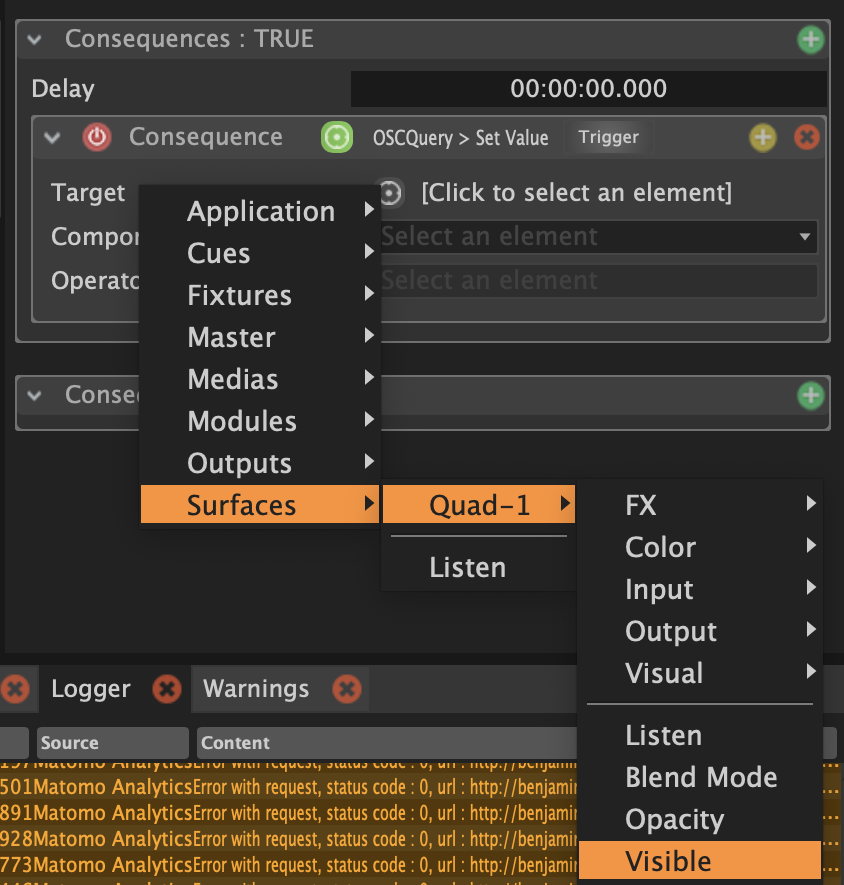

Dans `Operator`, on peux ensuite choisir de donner de modifier cette valeur, d'y ajouter un chiffre ou de l'inverser. Je choisis ici de l'inverser, la visibilité de la surface étant un booléen.

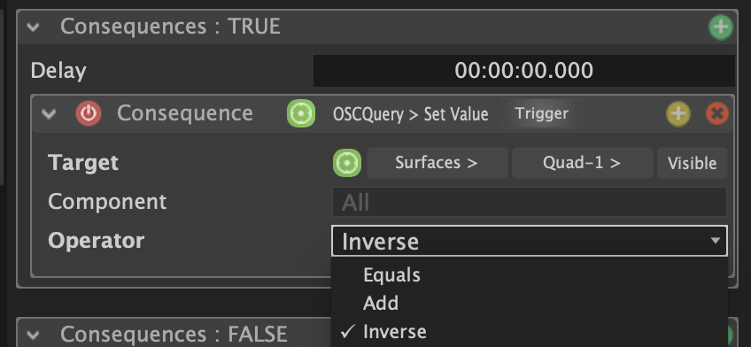

Ainsi, dès que j'appuie sur la première touche de mon contrôleur MIDI, la surface disparaît ou apparaît dans MadMapper.

### Mapping

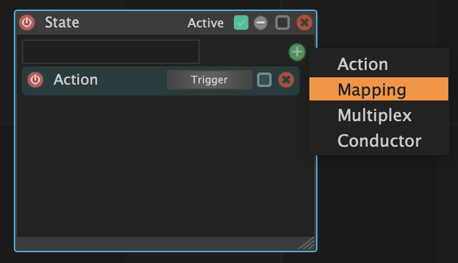

En cliquant sur le + en haut à droite du `State`, on peux créer un Mapping et  choisir ses conditions dans ses paramètres dans l'Inspector.

Un mapping 

